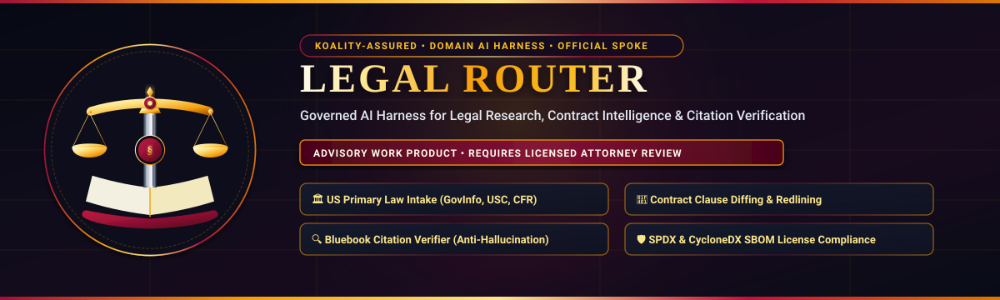
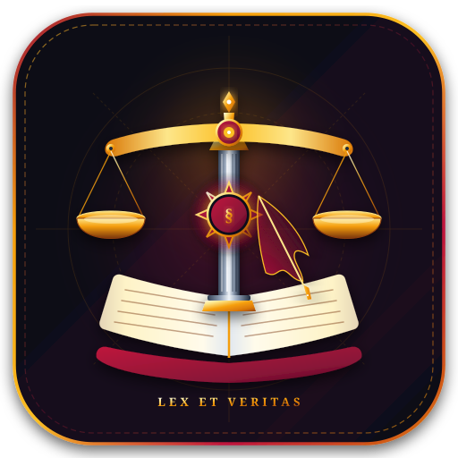
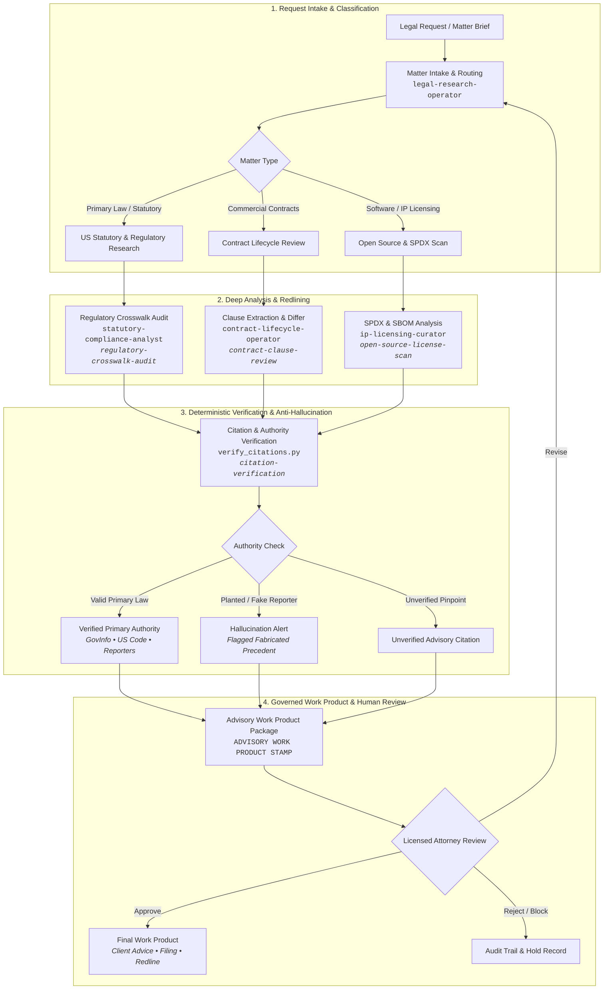

<div align="center">



<br/><br/>



# Legal Router

**Domain AI agent harness for legal research, contract analysis, regulatory compliance, US primary law navigation, and strict Bluebook citation verification.**

[](https://github.com/Koality-Assured/legal-router/actions/workflows/ci.yml)
[](LICENSE)
[](pyproject.toml)
[]()
[](https://conventionalcommits.org)

</div>

---

> [!IMPORTANT]
> **ADVISORY WORK PRODUCT — REQUIRES LICENSED ATTORNEY REVIEW**
> All outputs, analysis memoranda, clause redlines, regulatory crosswalks, and software license scans generated by Legal Router are strictly advisory machine-assisted work product. Legal Router does not practice law and does not provide legal advice. A licensed attorney must independently review, verify, and approve all findings prior to client communication, commercial negotiation, corporate execution, or court filing.

---

## Mission Statement

**Legal Router** is the domain-specialized AI agent harness within the Koality-Assured ecosystem dedicated to legal research, contract intelligence, regulatory governance, and citation integrity. 

Operating as an official spoke of `ai-harness-core`, Legal Router integrates high-integrity primary law retrieval, synthetic contract redlining, open-source license risk classification, and deterministic anti-hallucination citation verification into a secure, sandboxed multi-agent architecture.

---

## Core Capabilities

| Capability Area | Core Responsibilities | Key Tooling & Automation | Governed Outputs & Constraints |
| :--- | :--- | :--- | :--- |
| **US Primary Law Intake** | Official federal, state, and District of Columbia statutory and regulatory navigation. | Locators via `GovInfo`, United States Code (`USC`), Code of Federal Regulations (`CFR`), Federal Register. | Grounded in official packages; pinpoints unverified until session-validated; no HTML scraping when REST APIs exist. |
| **Contract Clause Risk & Redlines** | Clause extraction, high-risk term detection, synthetic redlining, and fallback position generation. | `scripts/legal/contract_differ.py`, synthetic clause taxonomy (`indemnity`, `limitation_of_liability`, `governing_law`). | Synthetic taxonomy only; no WorldCC/IACCM member scraping; client contracts never committed to git. |
| **Regulatory Compliance Audits** | Multi-framework statutory crosswalks mapping technical architectures to binding mandates. | `regulatory-crosswalk-audit` skill, crosswalk matrices covering EU AI Act, GDPR, HIPAA, FTC Act §5, NIST AI RMF. | Traceable statutory mappings; strict evidence citations; identifies compliance gaps with severity scoring. |
| **Citation Verification & Anti-Hallucination** | Parsing case reporters, statutes, and EU regulations; deterministic detection of fabricated precedents. | `scripts/legal/verify_citations.py`, Bluebook regex suite, CourtListener API integration, offline test fixtures. | Detects planted hallucinated citations (`Fake. Rep.`, `F.4d`); unparsed citations marked unverified; never claims zero hallucination. |
| **SPDX & SBOM License Governance** | Open-source software license auditing, copyleft risk isolation, and multi-license compatibility analysis. | `scripts/legal/spdx_license_checker.py`, CycloneDX & SPDX 2.3/3.0 parsers, normalized GNU expression handler. | Flags strong copyleft (`GPL`, `AGPL`), detects network copyleft propagation risks, and normalizes deprecated bare identifiers. |

---

## Legal Review Lifecycle

Legal Router coordinates domain intelligence across a four-stage pipeline ensuring strict attorney oversight:



---

## Domain Specialist Pack

Legal Router provides four specialized domain operators paired with schema-driven skills and deterministic Python tooling:

### Autonomous Agents

- [`contract-lifecycle-operator`](./ai-tooling/agents/contract-lifecycle-operator/AGENT.md): Analyzes commercial agreements, flags non-standard terms, generates structured redlines, and evaluates contractual liability caps.
- [`statutory-compliance-analyst`](./ai-tooling/agents/statutory-compliance-analyst/AGENT.md): Conducts regulatory crosswalks across privacy, data governance, cybersecurity, and artificial intelligence legal frameworks.
- [`ip-licensing-curator`](./ai-tooling/agents/ip-licensing-curator/AGENT.md): Audits open-source software dependencies, SBOM manifests, and copyleft exposure across proprietary and permissive commercial stacks.
- [`legal-research-operator`](./ai-tooling/agents/legal-research-operator/AGENT.md): Navigates official statutory compilations and caselaw repositories with strict locator verification.

### Domain Skills

- [`contract-clause-review`](./ai-tooling/skills/legal/contract-clause-review/SKILL.md): Automated extraction and risk classification of contract clauses against synthetic taxonomy baselines.
- [`regulatory-crosswalk-audit`](./ai-tooling/skills/legal/regulatory-crosswalk-audit/SKILL.md): Mapping technical implementations against statutory mandates (EU AI Act, GDPR, HIPAA, FTC Act §5, NIST AI RMF).
- [`open-source-license-scan`](./ai-tooling/skills/legal/open-source-license-scan/SKILL.md): Scanning SBOM packages for license expressions, strong copyleft flags, and dual-licensing conflicts.
- [`citation-verification`](./ai-tooling/skills/legal/citation-verification/SKILL.md): Comprehensive validation of legal citations against local suites and remote registry endpoints.

### Automation Scripts

- [`scripts/legal/verify_citations.py`](./scripts/legal/verify_citations.py): Offline and live citation verifier with hallucination detection.
- [`scripts/legal/contract_differ.py`](./scripts/legal/contract_differ.py): Structural clause differ and synthetic taxonomy extractor.
- [`scripts/legal/spdx_license_checker.py`](./scripts/legal/spdx_license_checker.py): SPDX / CycloneDX SBOM copyleft and compatibility scanner.

---

## Operating Guidelines & Compliance Boundaries

1. **Mandatory Advisory Stamp**: Every memorandum, clause redline, compliance crosswalk, and license audit carries the required notice: `ADVISORY WORK PRODUCT - REQUIRES LICENSED ATTORNEY REVIEW`.
2. **Attorney in the Loop**: AI agents provide initial issue spotting, extraction, and verification. Final legal determination and execution remain solely with licensed counsel.
3. **Strict Citation Discipline**: AI agents must never fabricate case reporters or statutory sections. Known planted fake reporters (`Fake. Rep.`, `F.4d`, `Halluc. 2d`) are flagged immediately, and unknown citations remain marked as `unverified`.
4. **No Proprietary Scraping**: No scraping of proprietary membership repositories (e.g., WorldCC / IACCM libraries) and no redistribution of copyrighted Bluebook tables.
5. **Client Confidentiality & Git Hygiene**: No client secrets, confidential draft agreements, or personally identifiable information (PII) are ever committed to repository version control. Mutating operations run inside ephemeral task worktrees (`scratch/worktrees/<slug>`).

---

## Quickstart & Validation

### 1. Run Citation Verification

Verify case and statutory citations against the offline fixture suite to validate anti-hallucination detection:

```bash
# Verify offline citation suite
python scripts/legal/verify_citations.py --dry-run --json

# Verify a specific legal memorandum
python scripts/legal/verify_citations.py --file scripts/legal/fixtures/citations/mixed-memo.md --json
```

### 2. Diff Contract Clauses

Extract and redline clauses across two agreements using synthetic taxonomy labels:

```bash
# Run contract differ across sample MSA revisions
python scripts/legal/contract_differ.py --left scripts/legal/fixtures/contracts/acme-vendor-msa-v1.md --right scripts/legal/fixtures/contracts/acme-vendor-msa-v2.md --json
```

### 3. Scan SPDX / SBOM Licenses

Audit software dependencies for copyleft contamination risks and deprecated SPDX identifiers:

```bash
# Scan synthetic CycloneDX / SPDX fixtures
python scripts/legal/spdx_license_checker.py --dry-run --json
```

### 4. Execute Full Verification Test Suite

Run the full Python test suite across all legal tools, routing mechanisms, and schema validators:

```bash
# Run all unit tests
python -m unittest discover -s scripts/tests -v
```

---

## Architecture & Spoke Protocol

Legal Router follows the Koality-Assured 12-area repository taxonomy:

```text
legal-router/
├── assets/                   # Vector branding assets (logo and hero banner)
├── AGENTS.md                 # Root normative contract, directive ranking, and cost rules
├── routing/                  # Hybrid dispatch, area mapping, and skill catalog
├── ai-tooling/               # Domain agents, skills, A2A interaction cards, and memory
│   ├── agents/               # Legal operators (contract, statutory, licensing, research)
│   └── skills/legal/         # Legal skills (citations, clauses, licenses, crosswalks)
├── docs/                     # Authoritative engineering and legal standards
│   └── standards/            # legal-overlay.md, context-management.md, harness-template.md
├── scripts/                  # Automation scripts
│   ├── legal/                # Citation verifier, contract differ, SPDX license checker
│   └── tests/                # Comprehensive unit test suite
├── supporting/               # Tool runtime guides and domain recipes
│   └── legal/                # Citation standards, redlining patterns, regulatory crosswalk
└── references/               # External standards (Conventional Commits, Markdownlint)
```

### Core ↔ Spoke Relationship

Legal Router is a **spoke** repository derived from `ai-harness-core`.
- **Pull Core Updates**: Synchronize generic harness improvements without overwriting domain overlays:
  ```bash
  python scripts/sync/pull_harness_core.py --dry-run --json
  ```
- **Propose Core Upgrades**: Propose generic framework improvements back to `ai-harness-core`:
  ```bash
  python scripts/sync/propose_core_update.py --dry-run --json
  ```

---

## License

This repository is licensed under the [MIT License](LICENSE).
